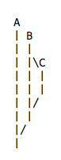

### Coloring differences by words
`git diff --cached --color-words=. `

### Rebase branch preserving merges
`git rebase *branchname* --preserve-merges`

You can rebase b on a preserving c branch

### Show differences between two files even if they're not indexed
`git diff --color-words  --no-index file1 file2`

### Show merged sub-branches of current branch
`git branch --merged`

### Rename tags
In this example I rename a `foo/bar/baz` tag into `baz`

`git tag | grep foo | awk '{split($0,a,"/"); print $0; system("git tag "a[3]" refs/tags/"$0); system("git tag -d "$0)}'`

### Credentials cache
If you're connecting to GitHub by https you probably like to avoid to be requested for your credentials every time you push

`git config --local credential.helper cache`
